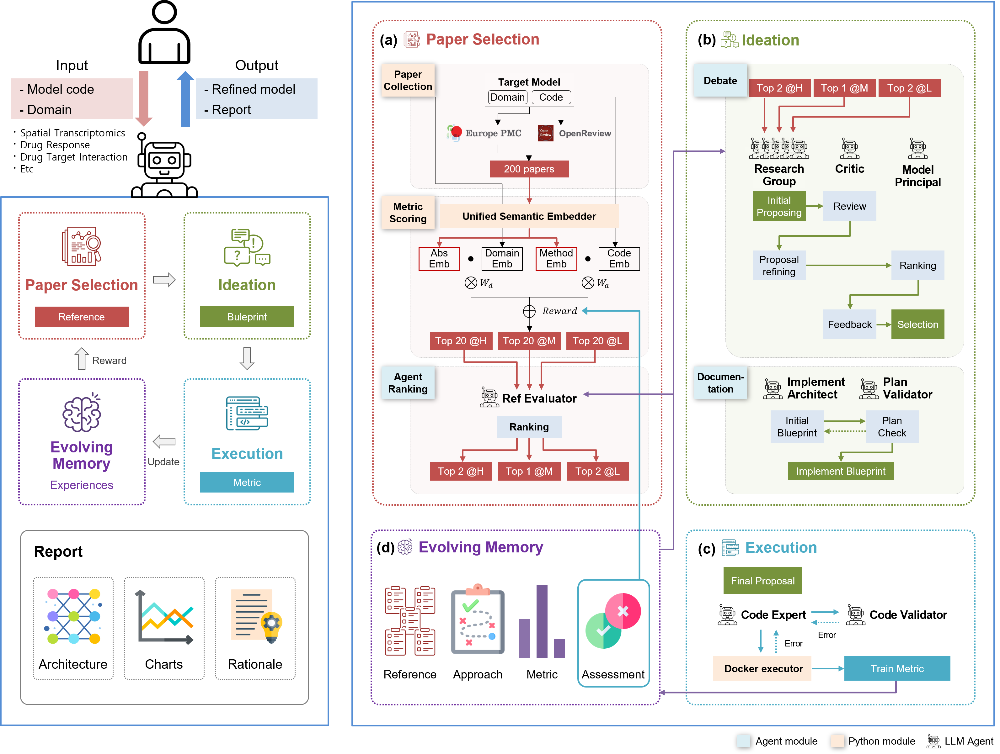

# MARBLE

**M**ulti-**A**gent **R**easoning for **B**ioinformatics **L**earning and **E**volution

MARBLE is an execution-stable autonomous framework for bioinformatics model refinement that utilizes multi-agent debate and performance-grounded reasoning.



## Requirements

- Python 3.11+
- Docker
- Conda (recommended)

## Installation

### 1. Create and Activate Environment

```bash
conda create -n marble python=3.11 -y
conda activate marble
```

### 2. Install Dependencies

```bash
# Install runtime dependencies (required)
pip install -e ".[runtime]"

# Install development tools (optional)
pip install -e ".[dev]"
```

### 3. Verify Installation

```bash
python -c "import langgraph, langchain, docker; print('All packages installed successfully')"
```

## Configuration

### 1. Set Up Environment Variables

```bash
cp .env.example .env
```

Edit `.env` and configure:

```bash
# Required API Keys
OPENAI_API_KEY="your-openai-api-key"
ANTHROPIC_API_KEY="your-anthropic-api-key"

# Project Settings
PROJECT_ROOT="/path/to/MARBLE"
USER_ID=$(whoami)
```

## Docker Setup

### 1. Build MCP Server Images

```bash
./infrastructure/container_management_scripts/build-mcp-images.sh
```

### 2. Build Model Execution Images

```bash
./docker_images/build.sh
```

### 3. Start MCP Servers

```bash
./infrastructure/container_management_scripts/start-mcp.sh
```

### 4. Download Datasets

Download the datasets from [Google Drive](https://drive.google.com/drive/folders/1NpdWpoRU5MSNTGGHkYOpr-2GtORaL7t2?usp=drive_link) and extract to the project root:

```bash
# Extract datasets.tar.gz to MARBLE/datasets/
tar -xzf datasets.tar.gz -C /path/to/MARBLE/
```

### 5. Download Reference Papers

```bash
python infrastructure/download_pdf/download_papers.py
```

This downloads bioinformatics papers from PMC and OpenReview for model training reference.

## Running MARBLE

### 1. Start LangGraph Server

```bash
langgraph dev --allow-blocking --no-reload --tunnel --port 3001
```

### 2. Execute MARBLE

#### Option A: LangSmith UI (Recommended)

1. Open the LangSmith Studio URL displayed in the terminal after starting the server
2. In the `messages` input field, enter:
   ```
   --task build --model stagate --iter 50 --patience 10 --weight 0.1
   ```
3. Click "Submit" to start the run

#### Option B: CLI

```bash
curl -X POST http://localhost:3001/runs/wait \
  -H "Content-Type: application/json" \
  -d '{
    "assistant_id": "MARBLE",
    "input": {
      "messages": [
        {
          "role": "user",
          "content": "--task build --model stagate --iter 50 --patience 10 --weight 0.1"
        }
      ]
    },
    "config": {
      "configurable": {},
      "recursion_limit": 5000
    }
  }'
```

### 3. Resume Interrupted Runs

If a run is interrupted and you want to continue from where it stopped:

```
--task continue --model stagate --iter {stopped_iter} --patience 10 --weight 0.1
```

Replace `{stopped_iter}` with the iteration number where the run was interrupted.

## Project Structure

```
MARBLE/
├── agent_workflow/          # Core agent workflow logic
│   ├── main_graph_builder.py
│   ├── state.py
│   └── workflow_subgraphs/
├── configs/                 # Configuration files
├── datasets/                # Training datasets (download from Google Drive)
├── docker_images/           # Drug response model containers
└── infrastructure/          # MCP server containers
```

## Sample Report

A sample execution report is available [here](https://sslim-aidrug.github.io/MARBLE/).

